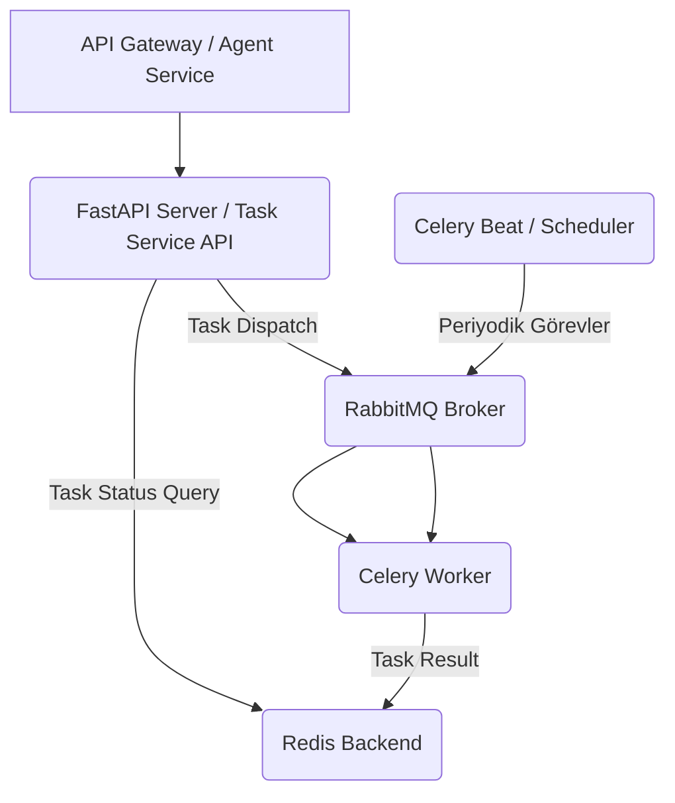

# ⚙️ Sentiric Task Service - Mantık ve Akış Mimarisi

**Stratejik Rol:** Asenkron, uzun süren veya periyodik görevleri (raporlama, veri temizleme, dış API senkronizasyonu) güvenilir bir şekilde yöneten merkezi görev kuyruğu sistemi.

---

## 1. Mimarisi: Celery Üçlemesi (API, Worker, Beat)

Task Service, üç ana bileşenden oluşur ve Celery (RabbitMQ/Redis) tarafından koordine edilir:

## 2. Görev Kategorileri

* Uzun Süren Görevler (Long-Running): Çağrı Kayıt Raporları (CDR), toplu veri işleme.
* Periyodik Görevler (Scheduled): Celery Beat tarafından yönetilir. Örn: Her 4 dakikada bir harici AI servislerini uyandırma (Platform Guardian).
* Harici İletişim: RabbitMQ'dan bir event'i alıp harici bir sisteme (örn: Salesforce) veri yazma.